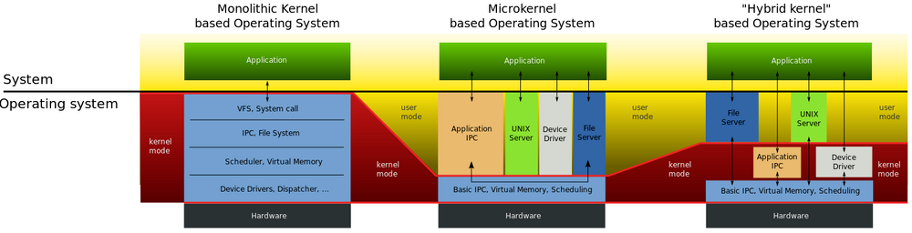
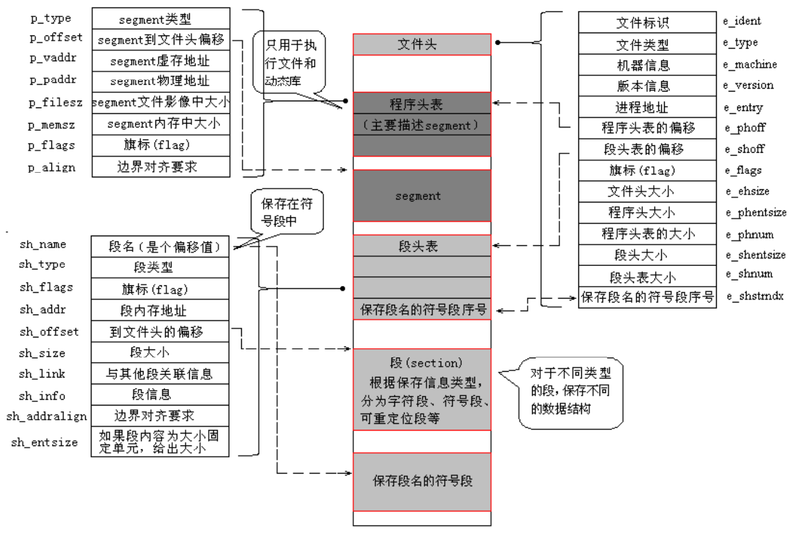

# Linux Kernel Module 

Time: Sep-13-2026

## [Linux内核模块 — [野火]嵌入式Linux驱动开发实战指南](https://doc.embedfire.com/linux/rk356x/driver/zh/latest/linux_driver/base_linuxkernel_module.html)

The Linux operating system employs the monolithic architecture, it has a distinct drawback: modifying or adding a kernel function (such as adding a device driver) requires recompiling the entire kernel. To address this specific limitation, Linux introduced the mechanism of kernel modules. The specific differences are illustrated in the image below:

A kernel module is a segment of kernel code that implements a specific function, it can be loaded into the kernel while it is running, thereby dynamically extending the kernel's capabilities. Loadable Kernel Module(LKM) is a mechanism for loading a set of object code at runtime to implement specific functionality.

At runtime, modules are linked to the kernel and executes within kernel space as part of the kernel—distinct from processes running in user space. Consequently, kernel modules possess the following characteristics: **The module itself is not compiled into the kernel image, which helps control the kernel's size. Once loaded, the module functions exactly like any other part of the kernel.**

- After compilation, a kernel module ultimately becomes an ELF file with the `.ko` extension. 
    
    Run `file xxx.ko` to view the kernel module. 
    
    In terms of data organization, `.ko` files follow the Executable and Linkable Format(ELF) and are standard relocatable object files. These files contain code and data and can be linked to form executable files or shared object files static link libraries also fall into this category.

    The possible layout of the ELF file format is as follows:

    

- At the beginning of the file is an ELF header, which describes the organization of the entire file, this information is independent of the processor and the rest of the file's contents. 
    
    Run `readelf -h xxx.ko` to view the detailed header information of an ELF file. 
    
- The section structure of an ELF file is determined by the section header table, which stores the basic attributes of these sections. Compilers, linkers and loaders rely on this table to locate and access the attributes of the various sections. 
    
    Run `readelf -S xxx.ko` to view the detailed information from the section header table of an ELF file. 
    
- Kernel modules are essentially incompletely linked ELF files, when loaded into the kernel, the kernel must perform final relocation (such as replacing symbol addresses with actual kernel virtual addresses), so they inevitably contain relocation tables. 
    
    Run `readelf -r xxx.ko` to view relocation tables.

- In an ELF file, strings are aggregated into a single table, and they are referenced using their offsets within this table.

    Run `readelf -p .modinfo xxx.ko` to view the string table of the modinfo section.

- The process of load a kernel module using the `insmod` command:
    
    - Read the `.ko` module from the filesystem into a memory buffer in user space.

    - Invokes the `sys_init_module()` system call to parse the module.

    - The kernel allocates memory in the `vmalloc` area—matching the size of the `.ko` file—to temporarily store the file's contents

    - Assigning its various sections to either the "init" segment or the "core" segment. 

    - Allocates memory within the "modules" area for these segments and copies the corresponding sections to their final runtime addresses in that area.

    - Release the "init" segment, leaving only the "core" segment to remain in memory for execution.

- The process of unload a kernel module using the `rmmod` command:

    - Pass the name of the module to be unloaded from user space.

    - Locate the module pointer based on the name.

    - Verify the module is not depended upon by any other modules.

    - Locate the module's exit function to perform the unloading.

- Symbols refer to the functions and variables declared using `EXPORT_SYMBOL` within a kernel module. 

    Once a module is loaded into the kernel, its exported symbols are recorded in the public kernel symbol table. After the module is loaded using the `insmod` command, it is linked to the kernel, thereby gaining access to the kernel's shared symbols.

- Use `EXPORT_SYMBOL(symbol_name)` macro to export module.

    Use `EXPORT_SYMBOL_GPL(symbol_name)` macro to ensure that the exported modules can only be used by GPL-licensed modules.

    When compiling the module, these two macros expand into the declaration of a special variable, which is stored in the ELF file's symbol table.

- Once the ELF symbol table is loaded into the kernel, `simplify_symbols` is executed to traverse the entire table. It determines the actual memory address by identifying the relevant section via `st_shndx` and the offset within that section via `st_value`. Finally, it stores the symbol's memory address and the pointer to its name in the kernel symbol table.

- The structure of the kernel's exported symbol table consists of two fields: the symbol's memory address and a pointer to the symbol name. The symbol names themselves are stored in the `__ksymtab_strings` section.

- When other kernel modules need to locate a symbol, they call `resolve_symbol_wait` to search for the target symbol by name within the kernel and other modules, `resolve_symbol_wait` calls `resolve_symbol`, which in turn calls `find_symbol`. Once the symbol is found, its actual address is assigned to the symbol table entry: `sym[i].st_value = ksym->value;`.