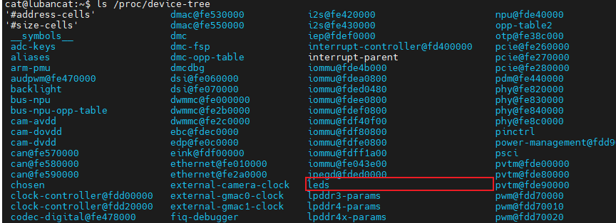
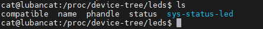
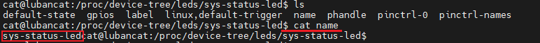
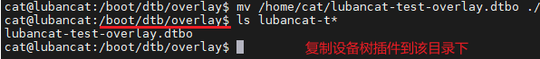

# Embedded Linux Development Basics

Time: Sep-9-2026

This is my first learning note of learning embedded linux. To be honest, I don't know how to learn it, so at first I tried to read the linux official documents and tutorials. These articles I read introduce some basic rules about linux kernel development and embedded linux, after reading these, I compiled a list of points to keep in mind. The list is updating and it's obvious that it won't be finished in one day. I have listed the articles I've read and included the links for future reference.

## [HOWTO do Linux kernel development — The Linux Kernel documentation](https://docs.kernel.org/process/howto.html)

- Arbitrary `long long` divisions and floating point are not allowed. 

- SPDX identifiers are necessary in source code.

- The kernel has a large number of documents that can be automatically generated from the source code itself or from ReStructuredText markups(ReST), run: `make pdfdocs`, `make  htmldocs`, `make latexdocs` or `make epubdocs` to generate.

- Make sure patches are plain readable text as stated in `Documentation/process/submitting-patches.rst` when adding patches to mail, use a mail program that does not mangle spaces and tab characters.  

- The list of files that are in the kernel source tree that are required reading:
    
    - Documentation/admin-guide/README.rst

    - Documentation/process/changes.rst

    - Documentation/process/coding-style.rst

    - Documentation/process/submitting-patches.rst

    - Documentation/process/stable-api-nonsense.rst

    - Documentation/process/security-bugs.rst

    - Documentation/process/management-style.rst

    - Documentation/process/stable-kernel-rules.rst

    - Documentation/process/kernel-docs.rst

    - Documentation/process/applying-patches.rst

## [驱动章节实验环境搭建 — [野火]嵌入式Linux驱动开发实战指南](https://doc.embedfire.com/linux/rk356x/driver/zh/latest/linux_driver/base_exper_env.html)

This tutorial was writing for LubanCat_RK series boards, I did't purchase them. So I just record some universal points.

- The programs ultimately run on the boards, it could be compiled on board or use a cross-compilor on PC, we need to download the kernel source code or corresponding kernel headers. Afterwards compile the source code, driver, modules and device tree, and finally copy the driver modules and device tree to the development boards for execution. What's more, a driver module is a program with independent functionality, it could be compiled indepently but could't run indepently, it will be linked to kernel as a part of kernel space while runing. So if we want to run a kernel module we wrote in some one edition of kernel, then we must compile it on that edition.

- Run `uname -a` on your board to check the kernel edition of it.

- The kernel source code cand be obtained by using `git clone` from the official repository or directly from SDK and compile it on the borad or use cross-compilor on PC.   

- Kernel modules can be compiled as separate modules and manually loaded by the user after the kernel boots, or they can be compiled directly into the kernel to be automatically loaded at startup. Testing is typically done by compiling the code into a separate kernel module and loading it manually, this facilitates debugging and saves time.

- Run `sudo insmod xxx.ko` to install a module and run `sudo rmmod xxx.ko` to uninstall a module, run `lsmod` to view currently loaded kernel modules.  

- Use dtc(Device Tree Compilor) to compile device tree, it can be found in `linux/scripts/dtc/dtc` or downloaded via a package manager(eg: `sudo apt install device-tree-compilor`). The device tree can also be compiled using the kernel's build scripts. The device tree files we need to use are all located in `linux/arch/arm64/boot/dts/`.

- Replace the device tree file in the borad's `/boot/dtb/` directory with the newly compiled device tree file to load the device tree. Boot up and log in to the board, then check the symbolic links in the `/boot/` directory to confirm the device tree currently in use. Run: `ls -l /boot/` to view device tree symbolic link.

- Device tree nodes have corresponding files in the file system, loacted in the `/proc/device-tree` directory. The contents of the `/proc/device-tree` directory are shown below.

    

    Next, enter the `led` folder, you can see the attributes definded within the `led` node as well as its child noded, as shown below.

    

    There is a `name` attribute among the node properties. However, upon examining the DTS source code, we never see a `name` attribute definded within the `led` node, This attribute is automatically generated to store the node name.

    Here, the atttibute is a file, while the child node is a folder, we enter the `sys-status-led` folder. Inside, there are attribute files such as `compatible`, `name` and `status`. We can use the `cat` command to view these attribute files, as shown below.

         

- Device tree overlay can dynamically expand functionality not described in the main device tree once the main device tree is definded. Use dtc or kernel's build scripts to compile the device tree overlays. The device tree and device tree overlay source code are both `.dts` files, the difference is that the device tree is compiled as a `.dtb` file, the device tree overlay, however, need to be compiled as a `.dtbo` file.

    Copy the `.dtbo` files to `/boot/dtb/overlay/` to load the device tree overlays, as shown in the figure below.

    